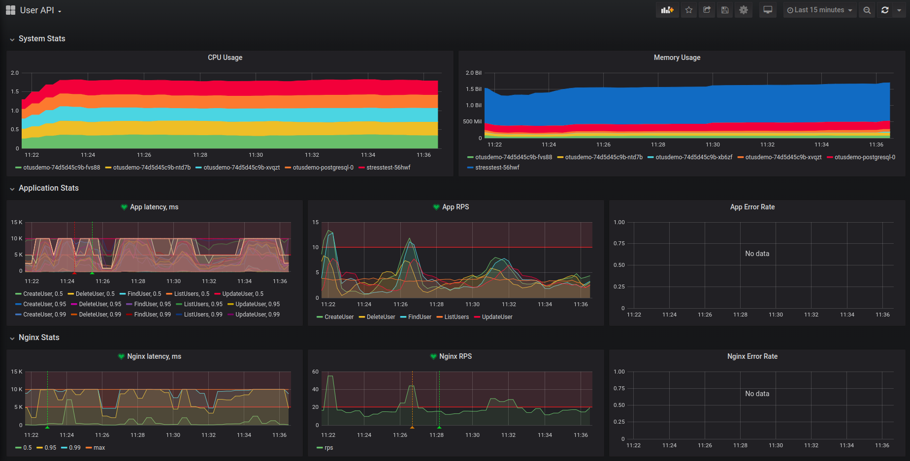

Демо сервис, реализующий CRUD REST API по управлению пользователями и инструментированный метриками в формате Prometeus.

Чтобы мониторить метрики приложения, применим конфигмап для dashboard графаны и развернем Prometheus в namespace'е monitoring:

```
minikube addons disable ingress
kubectl create namespace monitoring
helm install prom stable/prometheus-operator -f prometheus.yaml --atomic -n monitoring
helm install nginx stable/nginx-ingress -f nginx-ingress.yaml --atomic -n monitoring
```

Для мониторинга метрик БД установим postgres-exporter:

```
helm install postgre-metrics stable/prometheus-postgres-exporter -n monitoring
```

Создадим namespace для приложения и установим его в качестве текущего:

```
kubectl create namespace otus && kubectl config set-context --current --namespace=otus
```

Если приложение запускается в первый раз, необходимо обновить зависимости в helm:

```
make helm-update-dependencies
```

Устанавливаем приложение:

````
make run
````

Убеждаемся, что все запущено:

```
$ kubectl get all

NAME                            READY   STATUS    RESTARTS   AGE
pod/otusdemo-74d5d45c9b-fvs88   1/1     Running   6          7m8s
pod/otusdemo-74d5d45c9b-ntd7b   1/1     Running   6          7m8s
pod/otusdemo-74d5d45c9b-xvqzt   1/1     Running   6          7m8s
pod/otusdemo-postgresql-0       2/2     Running   0          7m8s

NAME                                   TYPE        CLUSTER-IP      EXTERNAL-IP   PORT(S)          AGE
service/otusdemo                       NodePort    10.110.28.84    <none>        9000:32560/TCP   7m8s
service/otusdemo-postgresql            ClusterIP   10.98.222.213   <none>        5432/TCP         7m8s
service/otusdemo-postgresql-headless   ClusterIP   None            <none>        5432/TCP         7m8s
service/otusdemo-postgresql-metrics    NodePort    10.107.71.96    <none>        9187:31753/TCP   7m8s

NAME                       READY   UP-TO-DATE   AVAILABLE   AGE
deployment.apps/otusdemo   3/3     3            3           7m8s

NAME                                  DESIRED   CURRENT   READY   AGE
replicaset.apps/otusdemo-74d5d45c9b   3         3         3       7m8s

NAME                                   READY   AGE
statefulset.apps/otusdemo-postgresql   1/1     7m8s
```

После запуска сервис доступен по адресу http://arch.homework/otusapp/.

Для запуска end-2-end тестов, используя newman:

```
newman run ./api/api.postman_collection.json
```

Для удаления приложения:

```
make remove
```

Запускаем прометей:

```
kubectl port-forward -n monitoring service/prom-prometheus-operator-prometheus 9090
```

и графану

```
kubectl port-forward -n monitoring service/prom-grafana 9000:80
```

и импортируем в нее дашборд User API:
 
```
kubectl apply -n monitoring -f grafana.yaml
```

Запускаем stress тест:

```
make run-stresstest
```

Останавливаем stress тест:

```
make stop-stresstest
```


